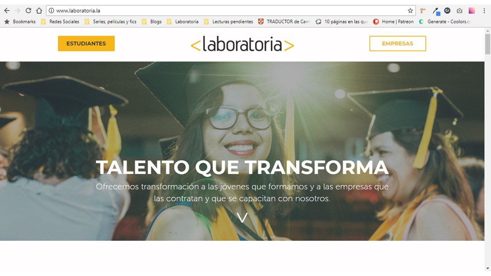
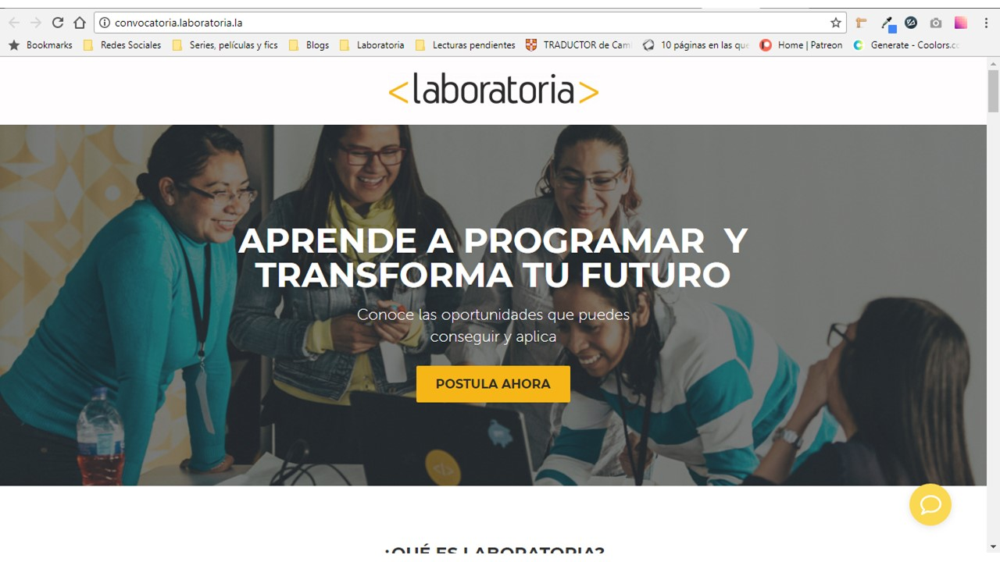
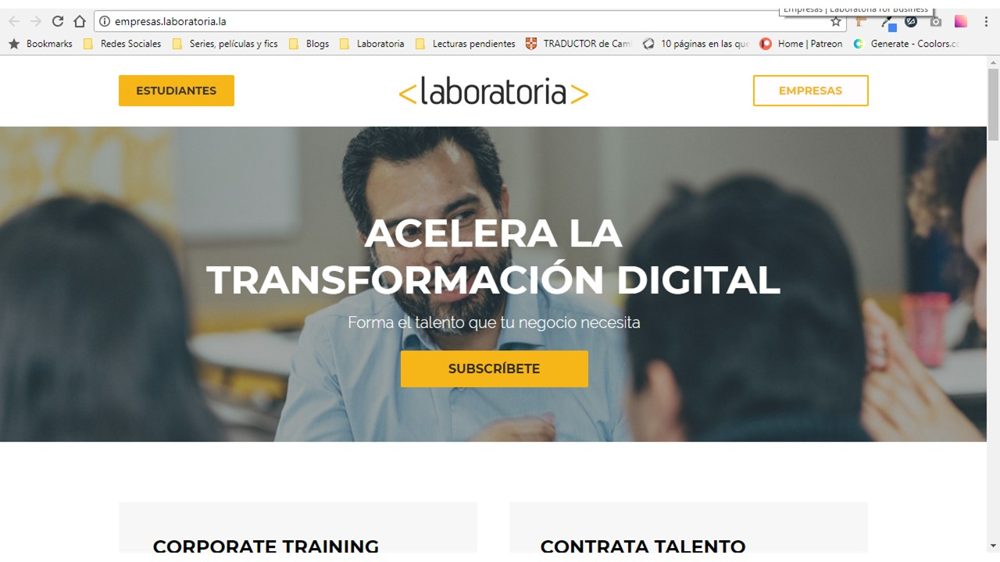
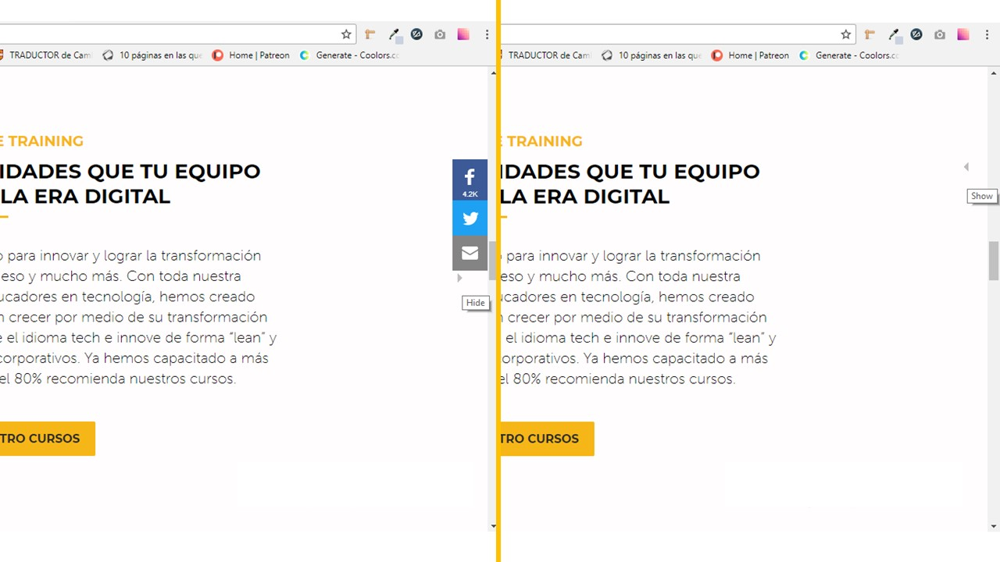
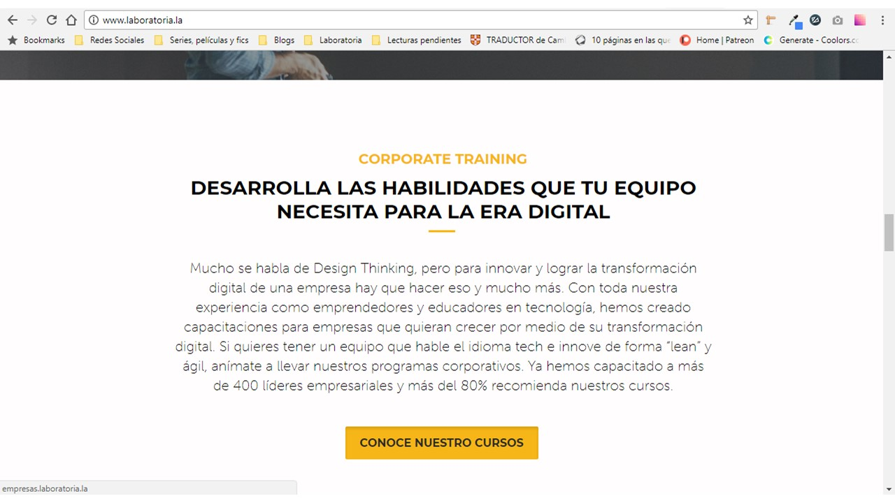
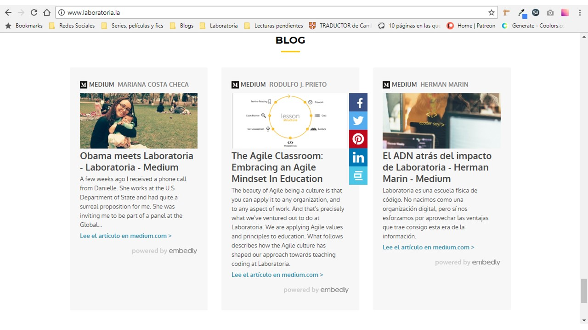
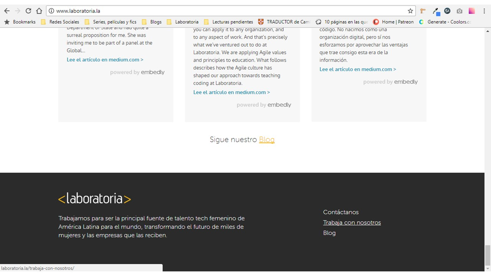

# Laboratoria

## Identificación de la parte UX y UI de la página

|UX                                               |UI                                                     |
|-------------------------------------------------|-------------------------------------------------------|
| Dar la opción de indicar si se es postulante o empresa y redireccionar a la página respectiva. | Colores de la marca (amarillo / negro / blanco).                            |
| Opción ocultar / mostrar barra de redes sociales.                                              | Tipografía sans-serif.                                                      |
| División en secciones para facilitar la búsqueda de información.                               | Diseño de botones con bordes ligeramente redondeados.                       |
| Fácil acceso a versiones completas de artículos y notas del blog.                              | Botón de desplazamiento en el banner principal.                             |
|                                                                                                | Animación de desplazamiento al clickear dicho botón.                        |
|                                                                                                | Barra de redes sociales fija a la derecha.                                  |
|                                                                                                | Sombra interior en los botones al ser clickeados.                           |
|                                                                                                | Hover que activa una barra de compartir en redes en los artículos del blog. |
|                                                                                                | Hover que aplica subrayado a los links.                                     |

-----------

Página principal Laboratoria

-----------

Página a la que redirecciona el botón ESTUDIANTES

-----------

Página a la que redirecciona el botón EMPRESAS

-----------

Mostrar/ocultar barra de redes sociales

-----------

Sombra interior en los botones al ser clickeados

-----------

Hover que muestra barra de compartir

-----------

Hover que subraya links
